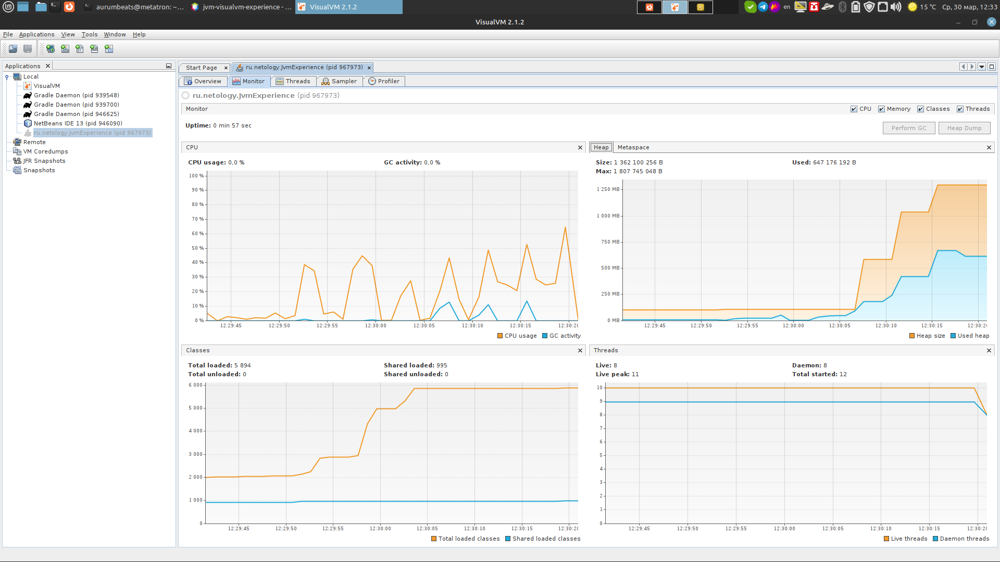
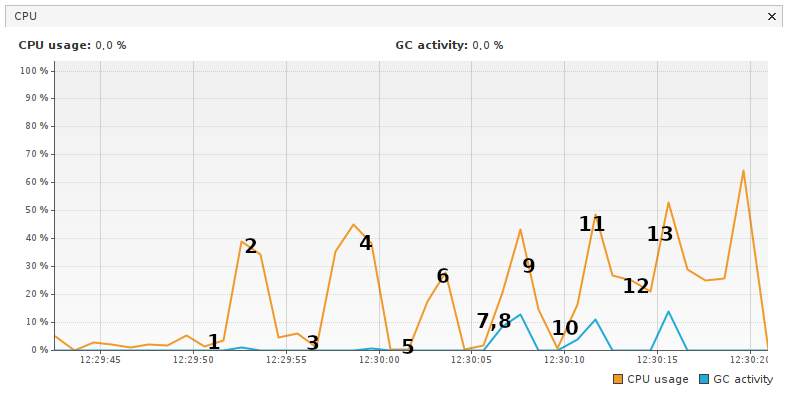
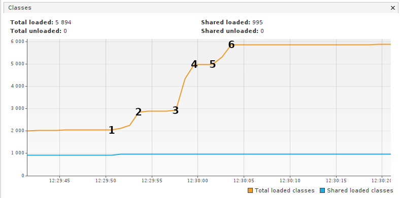
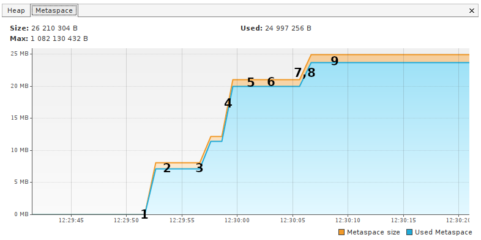
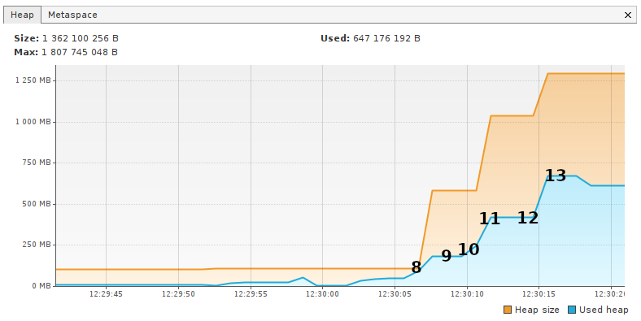

# Задача "Исследование JVM через VisualVM"
### Вывод программы в консоли после выполнения:
    12:29:51.518707: loading io.vertx
    12:29:53.647765: loaded 529 classes
    12:29:56.682015: loading io.netty
    12:29:59.212239: loaded 2117 classes
    12:30:02.213586: loading org.springframework
    12:30:03.094159: loaded 869 classes
    12:30:06.095461: now see heap
    12:30:06.097205: creating 5000000 objects
    12:30:07.382240: created
    12:30:10.384626: creating 5000000 objects
    12:30:11.445245: created
    12:30:14.617951: creating 5000000 objects
    12:30:15.521642: created
### Построчный разбор действий
    12:29:51.518707: loading io.vertx
    12:29:53.647765: loaded 529 classes
Загрузка классов из пакета io.vertx. Участок графиков под номером 1-2. Количество классов, загруженных в Metaspace, 
увеличилось с ~2000 до ~3000. Объем памяти в Metaspace, занятый загруженными классами, вырос до ~7,5 Мб (Описываю то, 
что вижу именно на графиках)
    
    12:29:53.647765: loaded 529 classes
    12:29:56.682015: loading io.netty
Поток в main() остановлен на 3 секунды. Участок графиков 2-3. Соответсвтенно, приращения по количеству загруженных 
классов и памяти в Metaspace равны ~0

    12:29:56.682015: loading io.netty
    12:29:59.212239: loaded 2117 classes
Поток в main() возобновлен, в Metaspace загружаются классы из пакета io.netty. Участок 3-4. Приращения по количеству загруженных 
классов и памяти в Metaspace соответственно равны ~2000 и ~4,5 Мб. Так же на данном участке заметна работа сборщика мусора, т.к.
объем занятой памяти в Heap уменьшился почти до ~0

    12:29:59.212239: loaded 2117 classes
    12:30:02.213586: loading org.springframework
Поток в main() остановлен на 3 секунды. Участок графиков 4-5. Соответсвтенно, приращения по количеству загруженных 
классов и памяти в Metaspace равны ~0

    12:30:02.213586: loading org.springframework
    12:30:03.094159: loaded 869 classes
Поток в main() возобновлен, в Metaspace загружаются классы из пакета org.springframework. Участок 5-6. Приращения по количеству загруженных 
классов и памяти в Metaspace соответственно равны ~900 и ~0 Мб

    12:30:03.094159: loaded 869 classes
    12:30:06.095461: now see heap
Поток в main() остановлен на 3 секунды. Участок графиков 6-7. Соответсвтенно, приращения по количеству загруженных 
классов и памяти в Metaspace равны ~0 и ~2,5 Мб

    12:30:06.097205: creating 5000000 objects
    12:30:07.382240: created
Участок 8-9. Создано 5000000 объектов. Приращение памяти в Metaspace - ~1 Мб, заметное приращение объема занятой памяти в Heap.

    12:30:07.382240: created
    12:30:10.384626: creating 5000000 objects
Участок 9-10. Поток в main() остановлен на 3 секунды. Далее приращения в Metaspace останавливаются, значение функции становится константой. 
Все - верно, ибо классы больше не загружаются. Незначительное, еле заметное приращение используемой памяти в Heap.
Далее участки 11-12 и от точки 13 - остановки потока в main() на 3 с практически нулевыми приращениями используемой памяти в Heap,
участки 10-11 и 12-13 - возобновление работы потока в main() со значительными приращениями в Heap в следствие создания 5000000 объектов на 
каждом из этих участков.
На каждом шаге размер Metaspace всегда больше занимаего классами объема памяти примерно на 1 Мб, тогда как куча увеличивается примерно в 2 раза

### Скриншоты из VisualVM

